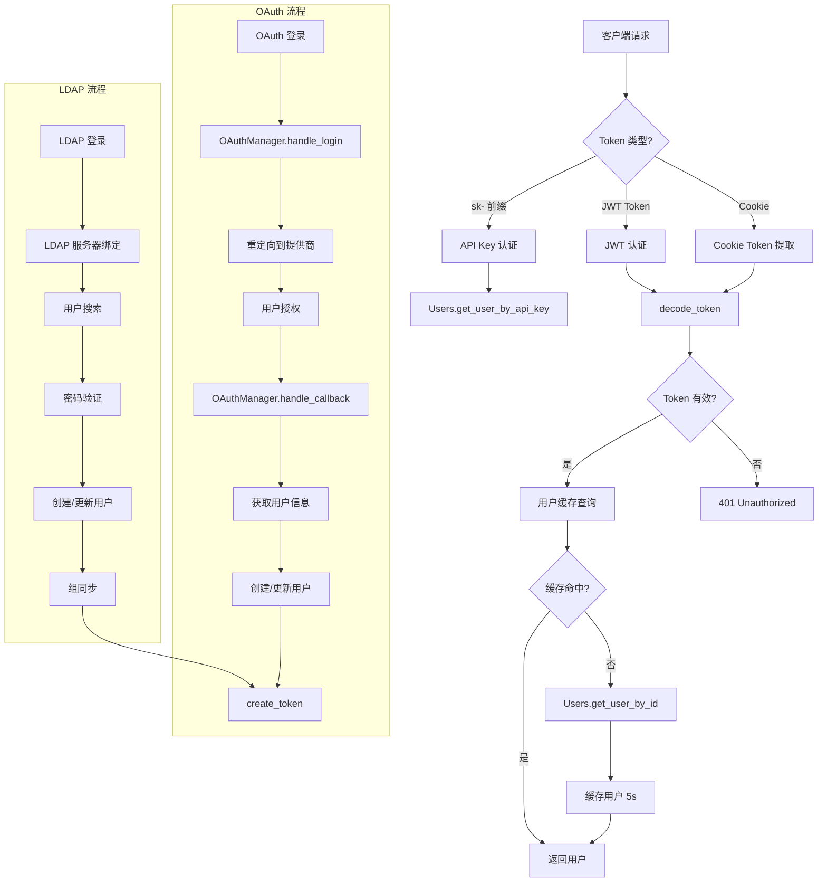

# 认证系统架构

## 1. 身份

- **项目定义**: 认证系统的核心实现架构，包含 JWT Token 生命周期、OAuth 集成、权限计算流程。
- **核心目标**: 提供可扩展的认证授权框架，支持多种身份提供商的无缝集成。

## 2. 核心组件

- `backend/open_webui/routers/auths.py` (signin, signup, ldap_auth, oauth_callback): 认证 API 端点，处理登录、注册、登出请求。
- `backend/open_webui/utils/auth.py` (create_token, decode_token, get_current_user, get_verified_user): JWT Token 创建、解码、用户认证中间件。
- `backend/open_webui/utils/oauth.py` (OAuthManager): OAuth 提供商管理，处理授权码流程和用户信息获取。
- `backend/open_webui/utils/access_control.py` (get_permissions, has_permission, has_access): 权限计算引擎，基于用户组进行权限合并。
- `backend/open_webui/models/auths.py` (AuthsTable): 认证数据表操作，密码验证、用户创建。
- `backend/open_webui/models/users.py` (User, UserModel, UsersTable): 用户数据模型，包含角色、API Key、OAuth 标识等字段。
- `backend/open_webui/config.py` (OAUTH_PROVIDERS, DEFAULT_USER_PERMISSIONS): OAuth 提供商配置加载、默认权限定义。

## 3. 认证流程 (LLM 检索地图)



### 3.1 JWT 认证流程

1. **Token 创建**: `backend/open_webui/utils/auth.py:151-164` - 创建包含 `id`, `exp`, `iat`, `jti` 的 JWT
2. **Token 验证**: `backend/open_webui/utils/auth.py:194-272` - 从 Cookie 或 Authorization Header 提取并验证
3. **用户缓存**: `backend/open_webui/utils/auth.py:46-62` - 5 秒 TTL 缓存减少数据库查询
4. **权限注入**: `backend/open_webui/routers/auths.py:113-126` - 登录成功后计算并返回用户权限

### 3.2 OAuth 认证流程

1. **发起登录**: `backend/open_webui/utils/oauth.py:227-237` - 重定向到 OAuth 提供商
2. **回调处理**: `backend/open_webui/utils/oauth.py:239-465` - 交换授权码获取 Token 和用户信息
3. **用户匹配**: 先按 `oauth_sub` 查找，可选按邮箱合并 (`OAUTH_MERGE_ACCOUNTS_BY_EMAIL`)
4. **角色/组同步**: `backend/open_webui/utils/oauth.py:91-146`, `backend/open_webui/utils/oauth.py:148-225` - 从 OAuth claims 同步角色和组

### 3.3 权限计算流程

1. **获取用户组**: `backend/open_webui/utils/access_control.py:56` - 查询用户所属的所有组
2. **权限合并**: `backend/open_webui/utils/access_control.py:38-54` - 多组权限取并集（最宽松值）
3. **权限检查**: `backend/open_webui/utils/access_control.py:72-107` - 支持点分隔的层级权限键
4. **资源访问**: `backend/open_webui/utils/access_control.py:110-129` - 基于 ACL 的资源访问控制

## 4. 权限系统设计

### 4.1 用户组与权限合并

权限采用"最宽松优先"原则合并:

```
用户权限 = DEFAULT_USER_PERMISSIONS ∪ (所有组权限的并集)
```

示例: 用户属于 `developers` 和 `admins` 两组
- `developers` 组: `{"chat": {"file_upload": true}}`
- `admins` 组: `{"chat": {"file_upload": false}}`
- 最终权限: `{"chat": {"file_upload": true}}` (取 true)

### 4.2 API Key 限制机制

`backend/open_webui/utils/auth.py:211-233`:
- 检查 `ENABLE_API_KEY` 全局开关
- 支持端点白名单 (`API_KEY_ALLOWED_ENDPOINTS`)
- 精确匹配或前缀匹配允许的路径

## 5. 设计决策

### 5.1 用户缓存策略

认证中间件使用 5 秒 TTL 的内存缓存 (`backend/open_webui/utils/auth.py:42-43`)，在高并发场景下减少数据库查询压力。缓存条目超过 1000 时自动清理过期条目。

### 5.2 OAuth 锁机制

使用 `asyncio.Lock()` 防止 OAuth 用户创建的竞态条件 (`backend/open_webui/utils/oauth.py:78`, `backend/open_webui/utils/oauth.py:311`)，确保首次登录时不会创建重复用户。

### 5.3 LDAP 组同步

LDAP 组同步 (`backend/open_webui/routers/auths.py:314-369`) 在每次登录时执行:
- 移除用户不再属于的组
- 添加用户新加入的组
- 组名从 DN 中提取 (`cn=devs,ou=groups` -> `devs`)
