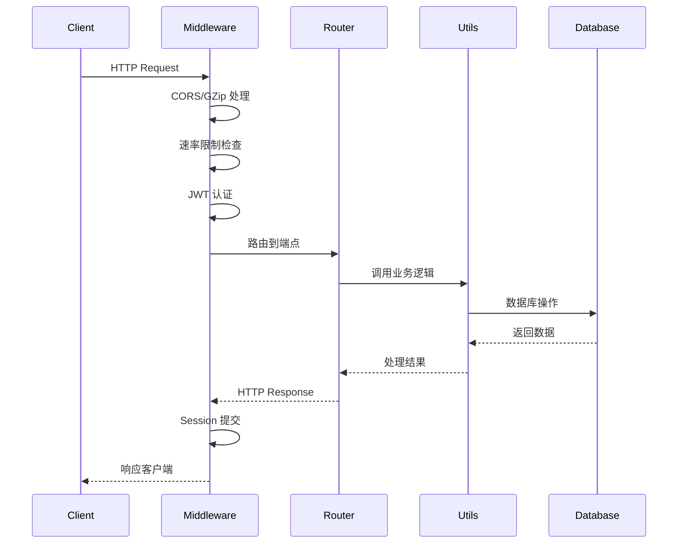

# 后端架构

## 1. 身份

- **项目定义**: HaloWebUI 后端采用分层架构设计，实现路由层、业务逻辑层和数据访问层的分离。
- **核心目标**: 提供可扩展、可维护的 API 服务架构，支持多租户、多模型、多渠道接入。

## 2. 目录结构

```
backend/open_webui/
├── main.py              # FastAPI 应用入口
├── config.py            # 配置管理系统
├── env.py               # 环境变量定义
├── constants.py         # 常量和错误消息
├── routers/             # API 路由层 (28 个模块)
│   ├── auths.py         # 认证路由
│   ├── chats.py         # 聊天路由
│   ├── openai.py        # OpenAI 兼容 API
│   ├── ollama.py        # Ollama 兼容 API
│   ├── gemini.py        # Gemini API
│   ├── anthropic.py     # Claude API
│   └── ...
├── models/              # 数据模型层 (16 个模型)
│   ├── users.py         # 用户模型
│   ├── auths.py         # 认证模型
│   ├── chats.py         # 聊天模型
│   └── ...
├── utils/               # 工具函数层
│   ├── auth.py          # JWT 认证工具
│   ├── access_control.py # 权限控制
│   ├── chat.py          # 聊天逻辑
│   ├── middleware.py    # 中间件处理
│   └── ...
├── internal/            # 内部模块
│   └── db.py            # 数据库连接
├── retrieval/           # RAG 检索模块
├── haloclaw/            # 消息网关模块
└── socket/              # WebSocket 服务
    └── main.py          # Socket.IO 服务
```

## 3. 核心组件

### 3.1 应用入口

`backend/open_webui/main.py` (FastAPI 实例、中间件、路由注册):
- 创建 FastAPI 应用实例，配置 lifespan 上下文管理器
- 注册 28 个 API 路由模块
- 配置中间件: CORS、GZip、安全头、审计日志、速率限制
- 初始化全局配置到 `app.state.config`

### 3.2 认证中间件

`backend/open_webui/utils/auth.py` (get_current_user, get_verified_user, get_admin_user):
- JWT 令牌验证 (HS256 算法)
- 用户缓存 (5 秒 TTL)
- API Key 认证支持

### 3.3 聊天处理管道

`backend/open_webui/utils/middleware.py` (process_chat_payload, process_chat_response):
- 请求预处理: 文件解析、RAG 检索、工具加载
- 响应后处理: 流式处理、错误重试、后台任务

`backend/open_webui/utils/chat.py` (generate_chat_completion):
- 多提供商路由: OpenAI、Ollama、Gemini、Anthropic
- 流式响应处理

### 3.4 数据库层

`backend/open_webui/internal/db.py` (Session, engine, Base):
- SQLAlchemy 异步会话管理
- scoped_session 线程安全

## 4. 请求生命周期



### 4.1 聊天请求流程

1. **请求接收**: `main.py:1308` `/api/chat/completions` 端点接收请求
2. **用户验证**: `get_verified_user` 依赖注入验证 JWT
3. **载荷处理**: `middleware.py:process_chat_payload` 预处理消息
4. **模型路由**: `chat.py:generate_chat_completion` 选择提供商
5. **流式响应**: 通过 Socket.IO 推送状态更新
6. **后处理**: `middleware.py:process_chat_response` 处理响应

## 5. API 路由设计

### 5.1 认证路由

`backend/open_webui/routers/auths.py` (router):
- `POST /signin` - 用户登录
- `POST /signup` - 用户注册
- `GET /ldap` - LDAP 认证
- `GET /oauth/{provider}` - OAuth 重定向

### 5.2 AI 提供商路由

| 提供商 | 文件 | 兼容 API |
|--------|------|----------|
| OpenAI | `routers/openai.py` | Chat Completions + Responses API |
| Ollama | `routers/ollama.py` | Ollama Native API |
| Gemini | `routers/gemini.py` | Google Generative AI API |
| Claude | `routers/anthropic.py` | Anthropic Messages API |

### 5.3 核心业务路由

`backend/open_webui/routers/chats.py` (router):
- `GET /api/v1/chats` - 获取聊天列表
- `POST /api/v1/chats` - 创建新聊天
- `GET /api/v1/chats/{id}` - 获取聊天详情
- `DELETE /api/v1/chats/{id}` - 删除聊天

## 6. 中间件栈

```
Request → RedirectMiddleware → SecurityHeadersMiddleware →
          commit_session → check_url → rate_limit (可选) →
          inspect_websocket → GZipMiddleware → CORSMiddleware → Router
```

关键中间件:
- `SecurityHeadersMiddleware`: 添加安全响应头
- `commit_session_after_request`: 请求后提交数据库会话
- `check_url`: 记录请求开始时间，提取认证令牌
- `rate_limit_middleware`: Redis 支持的 API 速率限制

## 7. 设计决策

### 7.1 配置三层架构

1. **环境变量**: 启动时从 `os.environ` 读取
2. **PersistentConfig**: 包装配置项，支持数据库持久化
3. **AppConfig**: 集中管理所有配置，支持 Redis 同步

### 7.2 认证双模式

- **JWT Token**: 标准 Web 会话认证
- **API Key**: 服务间调用认证，支持端点限制

### 7.3 提供商适配器模式

每个 AI 提供商路由实现统一接口:
- 模型列表获取
- 聊天完成 (流式/非流式)
- 文件上传支持 (部分提供商)

## 8. 相关文档

- 认证系统: `/llmdoc/agent/scout-auth.md`
- 配置系统: `/llmdoc/agent/scout-config.md`
- 模型集成: `/llmdoc/agent/scout-models.md`
- 存储系统: `/llmdoc/agent/scout-storage.md`
