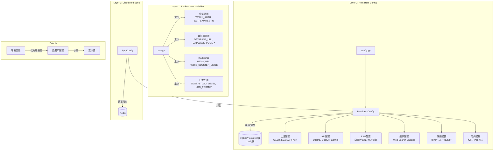

# 配置系统架构

## 1. Identity

- **What it is:** HaloWebUI 配置系统的技术实现架构，包含环境变量解析、持久化存储和分布式同步机制。
- **Purpose:** 为 LLM 提供配置系统的工作原理和代码导航路径。

## 2. Core Components

- `backend/open_webui/env.py` (全局变量): 定义基础环境变量，加载 `.env` 文件，设置目录路径、日志、数据库、Redis、认证等基础配置。
- `backend/open_webui/config.py` (`PersistentConfig`): 泛型持久化配置类，支持从环境变量和数据库加载配置值，运行时可更新。
- `backend/open_webui/config.py` (`AppConfig`): 配置管理类，封装 `PersistentConfig`，支持 Redis 分布式配置同步。
- `backend/open_webui/config.py` (`Config`): SQLAlchemy 模型，定义数据库 `config` 表结构，存储 JSON 格式配置数据。
- `backend/open_webui/utils/redis.py` (`get_redis_connection`): Redis 连接工具函数，支持 Sentinel 和 Cluster 模式。

## 3. Execution Flow (LLM Retrieval Map)

### 3.1 启动时配置加载流程

```
┌─────────────────────────────────────────────────────────────────────┐
│                          配置加载流程                                 │
└─────────────────────────────────────────────────────────────────────┘
                                │
                                ▼
┌─────────────────────────────────────────────────────────────────────┐
│ 1. env.py 模块加载                                                    │
│    - 加载 .env 文件 (dotenv)                                          │
│    - 解析基础环境变量 (DATA_DIR, DATABASE_URL, REDIS_URL 等)           │
│    - 设置日志级别和格式                                                 │
└─────────────────────────────────────────────────────────────────────┘
                                │
                                ▼
┌─────────────────────────────────────────────────────────────────────┐
│ 2. config.py 模块加载                                                 │
│    - 执行数据库迁移 (run_migrations)                                   │
│    - 检测并迁移 config.json → 数据库                                   │
│    - 加载 CONFIG_DATA (get_config)                                    │
└─────────────────────────────────────────────────────────────────────┘
                                │
                                ▼
┌─────────────────────────────────────────────────────────────────────┐
│ 3. PersistentConfig 实例化                                           │
│    - 读取环境变量值 (env_value)                                        │
│    - 查询数据库配置 (get_config_value)                                 │
│    - 确定最终值: 数据库值 > 环境变量值                                   │
│    - 注册到 PERSISTENT_CONFIG_REGISTRY                                │
└─────────────────────────────────────────────────────────────────────┘
```

### 3.2 配置读取流程

- **1. 环境变量层:** `env.py:27-33` 加载 `.env` 文件，`env.py:235-282` 解析数据库和目录配置。
- **2. 持久化层:** `config.py:191-194` 从数据库加载配置，`config.py:321-333` `PersistentConfig` 初始化逻辑。
- **3. 分布式同步:** `config.py:403-424` `AppConfig.__getattr__` 从 Redis 读取更新值。

### 3.3 配置写入流程

- **1. 本地保存:** `config.py:357-367` `PersistentConfig.save()` 更新数据库。
- **2. Redis 同步:** `config.py:392-401` `AppConfig.__setattr__` 同步到 Redis。

## 4. Configuration Categories Diagram



## 5. Design Rationale

**三层架构设计原因:**

1. **环境变量层:** 容器化部署标准，敏感信息安全存储，12-Factor App 规范。
2. **持久化层:** 支持运行时动态修改，无需重启服务，管理界面可调。
3. **分布式同步层:** 多实例部署时保证配置一致性，避免实例间配置漂移。

**Lite 预设机制:** 通过 `HALOWEBUI_LITE_PRESET` 环境变量快速配置常用场景，降低部署复杂度。
