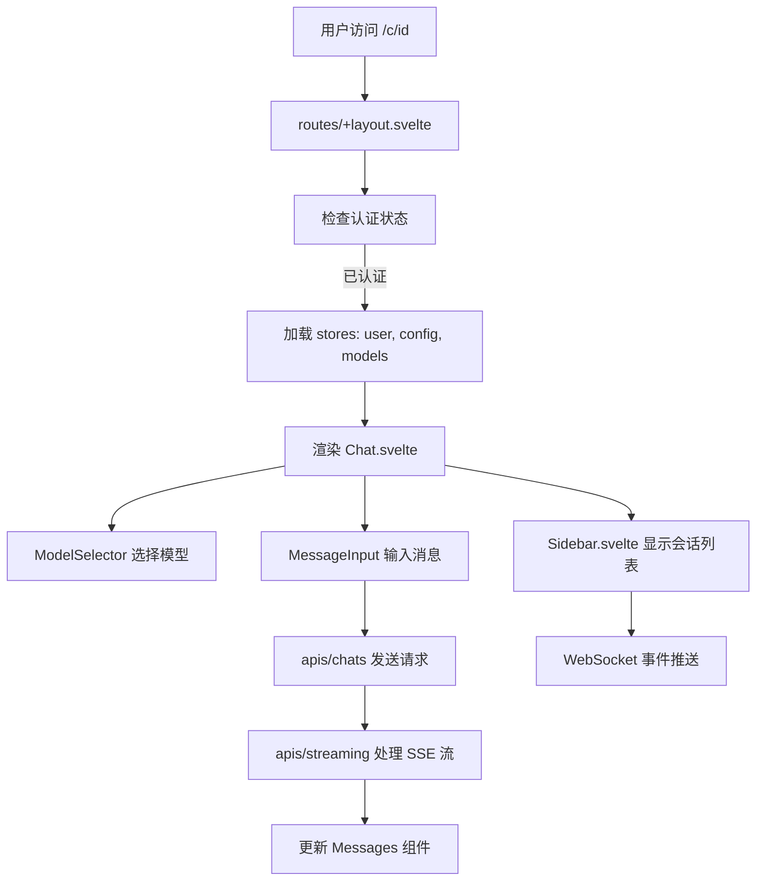

# 前端架构

## 1. 身份

- **定义**: HaloWebUI 前端的完整架构设计，包含组件组织、状态管理、API 层和路由结构。
- **作用**: 为 LLM 提供清晰的前端代码检索路径。

## 2. 核心组件

### 2.1 组件目录 (`src/lib/components/`)

- `src/lib/components/chat/Chat.svelte` (Chat): 核心聊天组件，处理完整聊天生命周期、消息历史、流式响应、模型选择、文件上传。
- `src/lib/components/chat/Messages.svelte` (Messages): 消息列表渲染。
- `src/lib/components/chat/MessageInput.svelte` (MessageInput): 消息输入组件，处理用户输入、文件上传、工具选择。
- `src/lib/components/chat/ModelSelector.svelte` (ModelSelector): 模型选择器。
- `src/lib/components/layout/Sidebar.svelte` (Sidebar): 侧边栏主组件，包含会话列表、文件夹、用户菜单。
- `src/lib/components/common/Modal.svelte` (Modal): 通用模态框。
- `src/lib/components/common/Dropdown.svelte` (Dropdown): 下拉菜单。
- `src/lib/components/common/CodeEditor.svelte` (CodeEditor): 代码编辑器。

### 2.2 状态管理 (`src/lib/stores/`)

- `src/lib/stores/index.ts`: 集中式状态管理，导出所有 writable store。
  - 后端状态: `config`, `user`, `models`, `chats`, `tools`, `functions`, `knowledge`
  - UI 状态: `showSidebar`, `showControls`, `showArtifacts`, `mobile`, `theme`
  - 会话状态: `chatId`, `chatTitle`, `activeChatIds`, `temporaryChatEnabled`
  - 配置缓存: `ollamaConfigCache`, `openaiConfigCache`, `geminiConfigCache`, `anthropicConfigCache`

### 2.3 API 层 (`src/lib/apis/`)

- `src/lib/apis/index.ts`: 核心 API（模型获取、聊天完成、任务管理、工具服务器）。
- `src/lib/apis/chats/index.ts`: 聊天 CRUD、分享、归档、标签。
- `src/lib/apis/auths/index.ts`: 认证（登录、注册、LDAP、API 密钥）。
- `src/lib/apis/models/index.ts`: 模型管理。
- `src/lib/apis/openai/index.ts`: OpenAI API 调用。
- `src/lib/apis/ollama/index.ts`: Ollama API 调用。
- `src/lib/apis/gemini/index.ts`: Gemini API 调用。
- `src/lib/apis/anthropic/index.ts`: Anthropic API 调用。
- `src/lib/apis/streaming/index.ts`: 流式响应处理（SSE 解析）。
- `src/lib/apis/files/index.ts`: 文件上传。
- `src/lib/apis/images/index.ts`: 图片生成。

### 2.4 服务层 (`src/lib/services/`)

- `src/lib/services/models.ts` (ensureModels, refreshModels): 模型加载服务，TTL 缓存（5分钟）和并发请求去重。

## 3. 执行流程（LLM 检索地图）

### 3.1 聊天请求流程

1. **用户输入**: `MessageInput.svelte` 捕获用户输入，调用 `apis/chats/index.ts` 创建/获取聊天。
2. **模型选择**: `ModelSelector.svelte` 从 `stores/models` 读取可用模型。
3. **API 调用**: `Chat.svelte` 调用 `apis/openai/index.ts` 或其他提供商 API 发起聊天请求。
4. **流式响应**: `apis/streaming/index.ts` 使用 EventSourceParserStream 解析 SSE 流。
5. **状态更新**: 响应数据更新 `stores/chatId`, `stores/chats` 等状态，触发 UI 重渲染。

### 3.2 认证流程

1. **布局检查**: `routes/(app)/+layout.svelte` 在加载时检查 `stores/user` 状态。
2. **未认证跳转**: 若 `user` 为空，重定向到 `/auth`。
3. **登录处理**: `routes/auth/+page.svelte` 调用 `apis/auths/index.ts` 进行认证。
4. **Token 存储**: 登录成功后，Token 存储在 `localStorage`，`user` store 更新。

## 4. 路由结构

### 4.1 应用内路由 (`(app)` 布局)

| 路径               | 组件                | 功能           |
| ------------------ | ------------------- | -------------- |
| `/`                | `+page.svelte`      | 首页/新聊天    |
| `/c/[id]`          | `+page.svelte`      | 聊天详情页     |
| `/channels/[id]`   | `+page.svelte`      | 频道详情页     |
| `/admin`           | `+page.svelte`      | 管理后台       |
| `/admin/[...path]` | `+page.svelte`      | 管理后台子路由 |
| `/settings/*`      | 多个 `+page.svelte` | 设置子页面     |
| `/workspace/*`     | 多个 `+page.svelte` | 工作区子页面   |

补充说明:

- 首页聊天占位区由 `src/lib/components/chat/Placeholder.svelte` 负责，现支持首页精选助手与建议提示词并存。
- 图片生成入口已集中到 `/workspace/images`，原 `playground/*` 页面已删除。
- 消息详情渲染链中新增 `src/lib/components/chat/Messages/MessageOutline.svelte`，用于桌面端消息大纲展示。

### 4.2 公开路由

| 路径      | 功能           |
| --------- | -------------- |
| `/auth`   | 登录/注册页面  |
| `/s/[id]` | 分享的聊天页面 |
| `/error`  | 错误页面       |

## 5. 设计原则

- **组件隔离**: 每个功能域组件独立，避免跨域直接依赖。
- **状态集中**: 所有全局状态在 `stores/index.ts` 统一导出，便于追踪和调试。
- **API 模块化**: 每个功能域独立 API 文件，统一使用 Bearer Token 认证。
- **流式优先**: 聊天响应使用 SSE 流式处理，支持大文本分块渲染。
- **类型安全**: 所有 Store 和 API 使用 TypeScript 类型定义。
