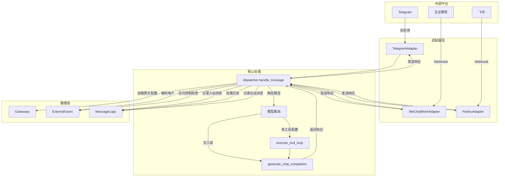

# HaloClaw 架构设计

## 1. 身份

- **项目定义**: HaloClaw 是一个基于适配器模式的消息网关系统。
- **核心目标**: 解耦消息平台差异，统一接入 HaloWebUI 的 AI 聊天管道。

## 2. 核心组件

- `backend/open_webui/haloclaw/models.py` (HaloClawGateway, HaloClawExternalUser, HaloClawMessageLog): 数据库模型定义和 CRUD 操作。
- `backend/open_webui/haloclaw/dispatcher.py` (handle_message, _FakeRequest): 核心消息分发器，连接外部消息到 AI 管道。
- `backend/open_webui/haloclaw/lifecycle.py` (startup_haloclaw, shutdown_haloclaw): 网关生命周期管理。
- `backend/open_webui/haloclaw/router.py` (APIRouter): 管理 API 和 Webhook 端点。
- `backend/open_webui/haloclaw/adapters/base.py` (BaseAdapter): 适配器抽象基类。
- `backend/open_webui/haloclaw/adapters/telegram.py` (TelegramAdapter): Telegram 平台适配器。
- `backend/open_webui/haloclaw/adapters/wechat_work.py` (WeChatWorkAdapter): 企业微信适配器。
- `backend/open_webui/haloclaw/adapters/feishu.py` (FeishuAdapter): 飞书适配器。

## 3. 适配器模式设计

```
                    ┌─────────────────┐
                    │   BaseAdapter   │ (抽象基类)
                    │  - start()      │
                    │  - stop()       │
                    │  - send_message │
                    │  - edit_message │
                    │  - send_photo   │
                    └────────┬────────┘
                             │
         ┌───────────────────┼───────────────────┐
         │                   │                   │
         ▼                   ▼                   ▼
┌─────────────────┐ ┌─────────────────┐ ┌─────────────────┐
│ TelegramAdapter │ │WeChatWorkAdapter│ │  FeishuAdapter  │
│  长轮询模式     │ │  Webhook模式    │ │  Webhook模式    │
│  Bot API       │ │  access_token  │ │  tenant_token  │
└─────────────────┘ └─────────────────┘ └─────────────────┘
```

### 3.1 BaseAdapter 接口

`backend/open_webui/haloclaw/adapters/base.py:5-55`

| 方法 | 说明 |
|------|------|
| `start()` | 启动适配器（开始监听消息） |
| `stop()` | 停止适配器（清理资源） |
| `send_message(chat_id, text)` | 发送文本消息 |
| `edit_message(chat_id, msg_id, text)` | 编辑已发送消息 |
| `send_photo(chat_id, image_url)` | 发送图片（可选实现） |

## 4. 消息流程图



## 5. 数据模型

### 5.1 HaloClawGateway

`backend/open_webui/haloclaw/models.py:21-39`

| 字段 | 类型 | 说明 |
|------|------|------|
| id | Text | 网关唯一标识 |
| user_id | Text | 网关所有者（HaloWebUI 用户） |
| platform | Text | 平台类型：telegram/wechat_work/feishu |
| name | Text | 网关显示名称 |
| config | JSONField | 平台特定配置（token、secret 等） |
| default_model_id | Text | 网关默认模型 |
| system_prompt | Text | 系统提示词 |
| access_policy | JSONField | 访问策略（白名单/黑名单/群聊策略） |
| enabled | Boolean | 是否启用 |

### 5.2 HaloClawExternalUser

`backend/open_webui/haloclaw/models.py:41-58`

| 字段 | 类型 | 说明 |
|------|------|------|
| id | Text | 用户唯一标识 |
| gateway_id | Text | 所属网关 |
| platform_user_id | Text | 平台用户 ID |
| halo_user_id | Text | 关联的 HaloWebUI 用户（可选） |
| model_override | Text | 用户模型覆盖 |
| is_blocked | Boolean | 是否被拉黑 |

### 5.3 HaloClawMessageLog

`backend/open_webui/haloclaw/models.py:60-79`

| 字段 | 类型 | 说明 |
|------|------|------|
| direction | Text | inbound/outbound |
| role | Text | user/assistant |
| content | Text | 消息内容摘要 |
| model_id | Text | 使用的模型 ID |
| prompt_tokens | Integer | 输入 token 数 |
| completion_tokens | Integer | 输出 token 数 |

## 6. 生命周期管理

`backend/open_webui/haloclaw/lifecycle.py:72-101`

```
应用启动
    │
    ▼
startup_haloclaw(app)
    ├─ 检查 ENABLE_HALOCLAW 开关
    ├─ 设置 dispatcher.app 引用
    ├─ 加载所有已启用的网关
    └─ 为每个网关创建并启动适配器
         │
         ▼
    适配器运行中 (处理消息)
         │
         ▼
shutdown_haloclaw(app)
    ├─ 停止所有运行中的适配器
    └─ 清理 dispatcher.app 引用
```

## 7. 设计决策

### 7.1 非流式响应

`backend/open_webui/haloclaw/dispatcher.py:158`

外部消息平台不支持 SSE 流式推送，因此 HaloClaw 强制 `stream: False`，收集完整响应后一次性发送。

### 7.2 Webhook 后台处理

`backend/open_webui/haloclaw/router.py:411-421`

企业微信和飞书的 Webhook 端点使用 `asyncio.create_task()` 在后台处理消息，确保在平台超时（5秒）内返回 `success` 响应。

### 7.3 合成用户

`backend/open_webui/haloclaw/dispatcher.py:282-305`

当外部用户未关联 HaloWebUI 账户时，创建合成用户对象（admin 角色）以绕过模型 ACL 限制。
