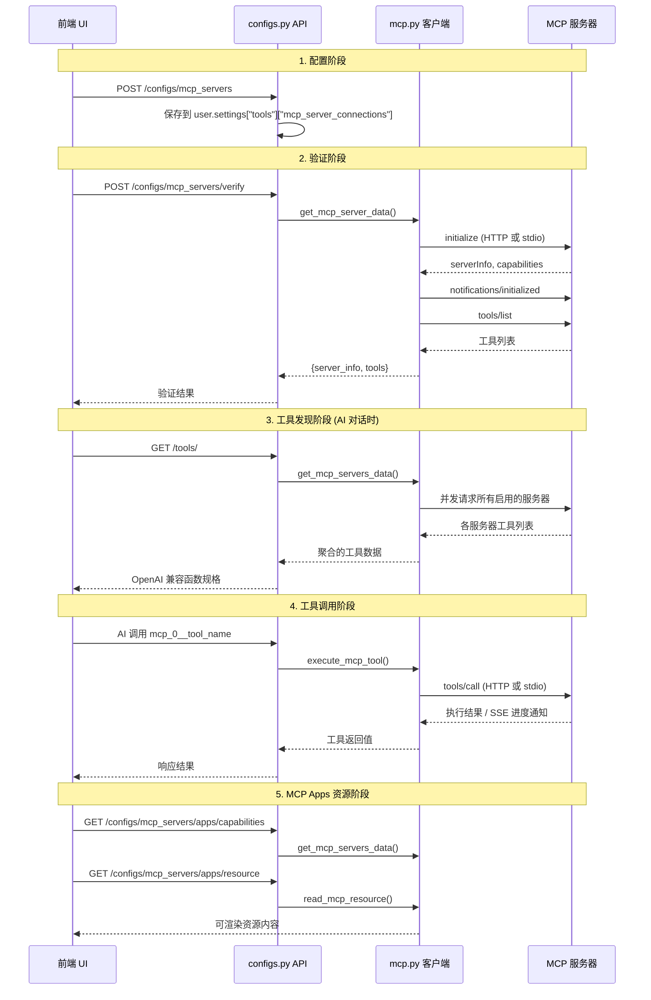

# MCP 集成架构

## 1. 身份

- **项目定义**: MCP 集成模块负责实现 Model Context Protocol 的客户端功能，使 HaloWebUI 能够与 MCP 服务器通信。
- **核心目标**: 提供标准化的工具发现和调用机制，将 MCP 工具无缝集成到 AI 对话流程中。

## 2. 核心组件

- `backend/open_webui/utils/mcp.py` (MCPStreamableHttpClient, MCPStdioClient, MCPStdioProcessManager, get_mcp_server_data, execute_mcp_tool, read_mcp_resource): MCP 核心客户端实现，处理 HTTP/`stdio` 传输、协议协商、会话管理、工具调用与资源读取。
- `backend/open_webui/utils/tools.py` (get_tools, make_mcp_function_name): 工具聚合入口，将 MCP 工具转换为 OpenAI 兼容函数规格。
- `backend/open_webui/utils/user_tools.py` (get_user_mcp_server_connections, set_user_mcp_server_connections, get_user_mcp_apps_config): 用户级 MCP 配置与 `MCP Apps` 状态存取。
- `backend/open_webui/routers/configs.py` (MCPServerConnection, get_mcp_servers_config, verify_mcp_server_connection, get_mcp_apps_capabilities): MCP 配置与 `MCP Apps` 能力 API。
- `backend/open_webui/routers/mcp.py` (read_resource, call_tool, list_resources, list_prompts): 前端 `MCP Apps` 桥接 API。
- `backend/open_webui/routers/tools.py` (get_tools): 工具列表 API，聚合 MCP 工具。
- `src/lib/apis/configs/index.ts` (getMCPServerConnections, setMCPServerConnections, verifyMCPServerConnection): 前端 MCP API 函数。
- `src/lib/components/admin/Settings/Tools/MCPServerModal.svelte`: MCP 服务器配置 UI 组件。

## 3. 执行流程



## 4. 数据流详解

### 4.1 配置存储

用户级配置存储于 `user.settings["tools"]["mcp_server_connections"]`，`MCP Apps` 全局开关独立存储于 `user.settings["tools"]["mcp_apps_config"]`:

```json
{
  "tools": {
    "mcp_server_connections": [
      {
        "transport_type": "http",
        "url": "https://mcp.example.com/mcp",
        "name": "示例服务器",
        "auth_type": "bearer",
        "key": "xxx",
        "config": { "enable": true },
        "mcp_apps": { "enabled": true },
        "server_info": { ... },
        "tool_count": 5,
        "verified_at": "2026-04-02T12:00:00Z"
      }
    ],
    "mcp_apps_config": {
      "ENABLE_MCP_APPS": true
    }
  }
}
```

### 4.2 工具发现流程

1. `routers/tools.py:get_tools` 端点被调用
2. 请求 `request.state.MCP_SERVERS` 获取预加载的服务器数据
3. 遍历每个 MCP 服务器的工具列表
4. 使用 `make_mcp_function_name()` 生成 OpenAI 兼容函数名
5. 将 MCP 工具的 `inputSchema` 转换为 OpenAI `parameters` 格式
6. 跳过仅面向 `app` 可见的 MCP 工具，并把 `ui.resourceUri` 写入工具元数据
7. 返回聚合后的工具字典

### 4.3 工具调用流程

`backend/open_webui/utils/tools.py:229-283`:

1. 解析工具名，提取 `server_idx` 和原始工具名
2. 获取对应的 MCP 服务器连接配置
3. 构建 `execute_mcp_tool()` 调用
4. 根据 `transport_type` 选择 HTTP 客户端或 `stdio` 进程池客户端
5. 可选：通过 `on_notification` 回调转发进度通知到 UI

## 5. JSON-RPC 方法映射

| MCP 操作 | JSON-RPC 方法 | 说明 |
|----------|---------------|------|
| 初始化 | `initialize` | 协商协议版本和能力 |
| 初始化通知 | `notifications/initialized` | 通知服务器客户端已就绪 |
| 工具列表 | `tools/list` | 获取可用工具及参数规格 |
| 工具调用 | `tools/call` | 执行指定工具 |

## 6. SSE 进度通知

MCP 服务器可通过 SSE 流发送进度通知:

| 通知类型 | 说明 |
|----------|------|
| `notifications/progress` | 执行进度 (progress/total) |
| `notifications/message` | 日志消息 (level/data) |

前端通过 `__event_emitter__` 回调接收并展示进度状态。

## 7. 设计要点

- **HTTP 无状态会话**: HTTP 工具调用默认使用短生命周期客户端，减少跨请求状态耦合
- **stdio 进程复用**: `MCPStdioProcessManager` 按用户和命令指纹复用本地进程，并在空闲后自动回收
- **协议协商回退**: `initialize` 失败时会根据服务器返回的支持版本自动回退
- **并发发现**: 使用 `asyncio.gather()` 并发获取多个 MCP 服务器的工具列表
- **错误隔离**: 单个 MCP 服务器连接失败不影响其他服务器的工具发现
- **Apps 资源代理**: `ui://` 资源通过后端代理为同源 URL，供前端安全渲染
- **名称清洗**: 工具名转换为 OpenAI 兼容格式，确保函数名合法且唯一
