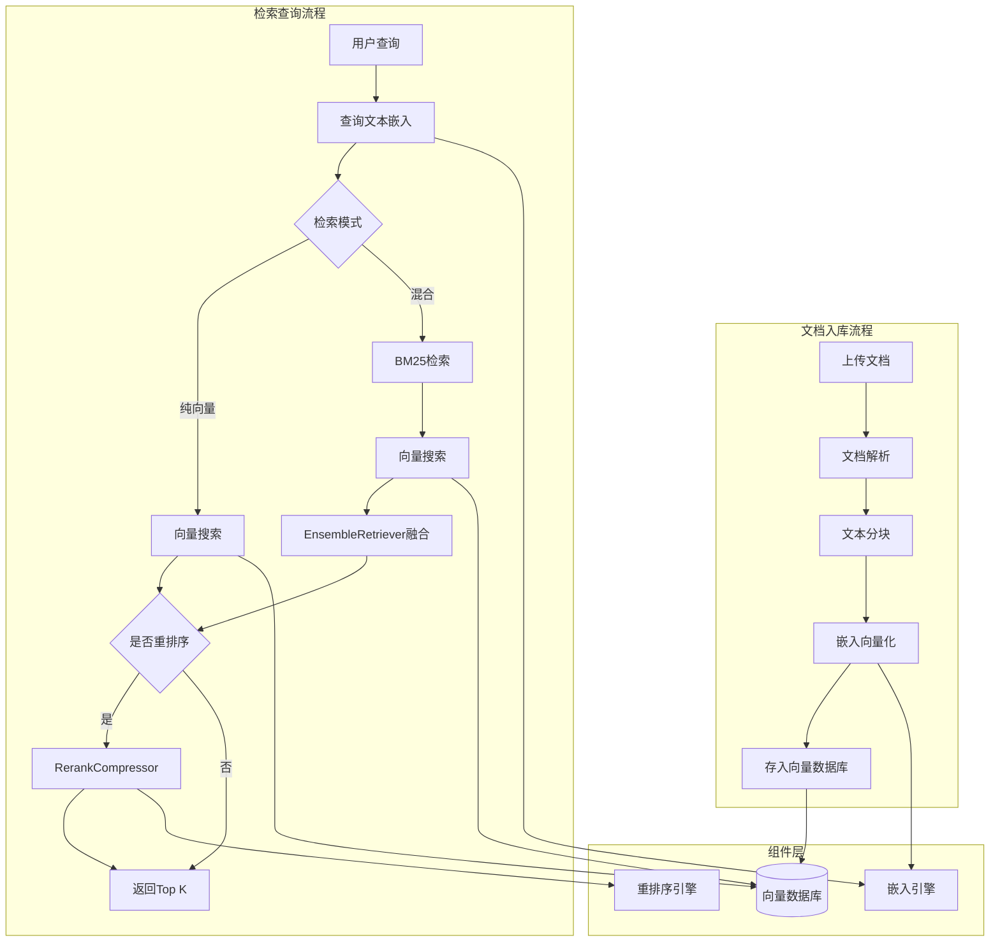

# RAG 系统架构

## 1. 身份

- **定义**: RAG 系统是 HaloWebUI 的知识检索核心模块，负责文档向量化、知识库存储与检索、结果重排序等功能。
- **目的**: 为 AI 对话提供精准的知识上下文，增强回答的准确性和可信度。

## 2. 核心组件

### 向量数据库连接器

`backend/open_webui/retrieval/vector/connector.py:25-66` (`_build_vector_db_client`, `VECTOR_DB_CLIENT`): 工厂函数，根据 `VECTOR_DB` 配置实例化对应的数据库客户端。

数据库实现:

| 文件                          | 客户端类              | 特点                                    |
| ----------------------------- | --------------------- | --------------------------------------- |
| `vector/dbs/chroma.py`        | `ChromaClient`        | 默认选择，HNSW 索引，支持本地/HTTP 模式 |
| `vector/dbs/qdrant.py`        | `QdrantClient`        | 远程连接，API Key 认证，集合前缀支持    |
| `vector/dbs/milvus.py`        | `MilvusClient`        | 自定义索引类型，Token 认证              |
| `vector/dbs/pgvector.py`      | `PgvectorClient`      | PostgreSQL 扩展，ivfflat 索引           |
| `vector/dbs/opensearch.py`    | `OpenSearchClient`    | knn_vector 类型，FAISS 引擎，HNSW 算法  |
| `vector/dbs/elasticsearch.py` | `ElasticsearchClient` | dense_vector 类型，cosine 相似度        |

### 嵌入引擎

`backend/open_webui/retrieval/utils.py:363-420` (`get_embedding_function`): 根据引擎类型返回对应的嵌入函数。

`backend/open_webui/retrieval/utils.py:637-784` (`generate_openai_batch_embeddings`, `generate_ollama_batch_embeddings`): 远程 API 批量嵌入生成。

`backend/open_webui/retrieval/runtime.py:92-115` (`get_ef`): 本地嵌入模型初始化 (sentence-transformers)。

### 重排序引擎

| 文件                           | 类             | 引擎类型                         |
| ------------------------------ | -------------- | -------------------------------- |
| `retrieval/models/jina.py`     | `JinaReranker` | Jina API 远程重排序              |
| `retrieval/models/colbert.py`  | `ColBERT`      | ColBERT 本地重排序               |
| `retrieval/runtime.py:157-172` | CrossEncoder   | sentence-transformers 本地重排序 |

`backend/open_webui/retrieval/utils.py:794-863` (`RerankCompressor`): LangChain 文档压缩器，整合重排序模型或余弦相似度计算。

### 核心检索函数

`backend/open_webui/retrieval/utils.py:78-95` (`query_doc`): 单文档向量搜索。

`backend/open_webui/retrieval/utils.py:112-178` (`query_doc_with_hybrid_search`): 混合搜索 (BM25 + 向量 + 重排序)。

`backend/open_webui/retrieval/utils.py:259-284` (`query_collection`): 多集合检索与结果合并。

`backend/open_webui/retrieval/utils.py:287-360` (`query_collection_with_hybrid_search`): 多集合混合搜索，支持并行处理。

### 数据模型

`backend/open_webui/retrieval/vector/main.py:5-19`:

- `VectorItem`: 向量项 (id, text, vector, metadata)
- `GetResult`: 获取结果 (ids, documents, metadatas)
- `SearchResult`: 搜索结果 (含 distances)

## 3. 执行流程 (LLM 检索地图)

### 检索流程详细步骤

1. **请求入口**: API 调用 `get_sources_from_files()` (`retrieval/utils.py:423-593`)
2. **嵌入生成**: 调用 `ensure_embedding_runtime()` (`retrieval/runtime.py:187-213`) 初始化嵌入函数
3. **向量搜索**: 调用 `query_collection()` 或 `query_collection_with_hybrid_search()`
4. **结果合并**: `merge_and_sort_query_results()` 去重并按分数排序
5. **重排序**: 若启用混合搜索，`RerankCompressor` 对结果重排序并过滤低分项

## 4. 设计决策

- **统一距离度量**: 所有向量数据库实现均使用余弦相似度，避免不同数据库的度量差异
- **可选依赖加载**: 非核心数据库客户端采用延迟导入，减少默认安装的依赖体积
- **混合搜索降级**: 混合搜索失败时自动降级为纯向量搜索，保证服务可用性
- **批处理优化**: 嵌入生成支持批处理 (`RAG_EMBEDDING_BATCH_SIZE`)，减少 API 调用次数
